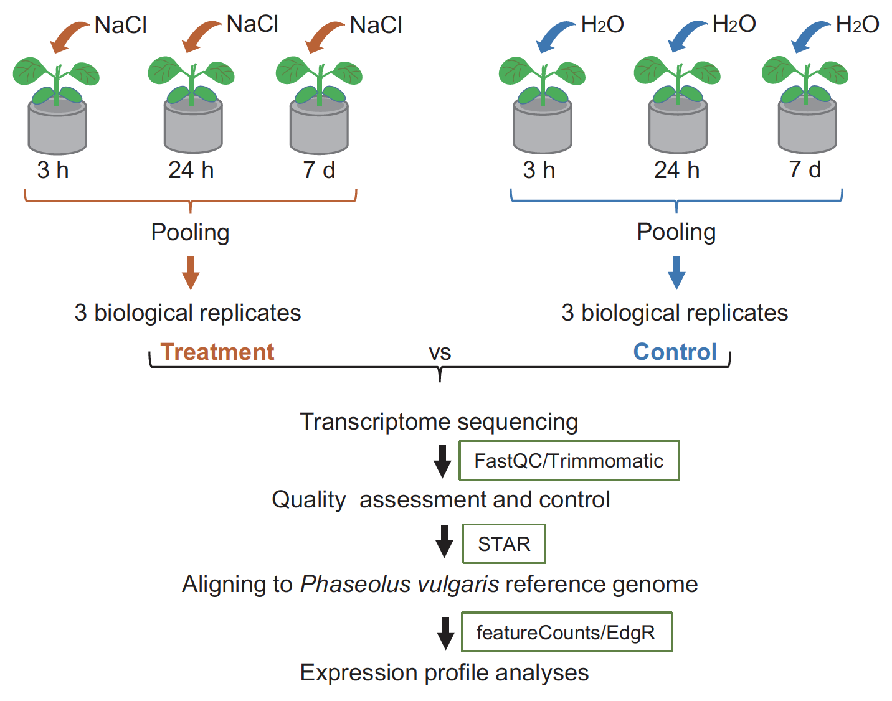

## Data preprocessing

### Overview
* Reading in table of counts
* Data transformation
* Gene filtering
* Normalization for composition bias
* Sample clustering


### Experimental Design

Data for this workshop comes from a Nature Scientific Data paper by [Zhang et al., 2018](https://www.nature.com/articles/sdata2018290). The study examimes mechanisms of saline adaptation of a plant (_Strophostyles helvola_) related to the common bean (_Phaseolus vulgaris_). Briefly stated, the study reported the RNA-seq analyses of two genotypes (a salt tolerant beach genotype and a salt-sensitive inland genotype, see figure below) and provided sequence data for community use. Sequence data was deposited in the National Center for Biotechnology Information (NCBI) Sequence Read Archive (SRA) repository, and the abundance count for all the samples was deposited at Gene Expression Omnibus (GEO) database. 

{width=80%}

First, we load required packages:

```{r, purl=FALSE}
library(edgeR) #Main package for DE analysis
library(tidyverse) #Data wrangling package, includes ggplot2, dplyr, tidy, readr
library(RColorBrewer) #Colour scheme for plotting
#library(Glimma) #Interactive MD plots
library(gplots)
```

For this workshop, the count data from the study will be obtained from the figshare repository, as shown below:
```{r, purl=FALSE}
download.file(url = "https://ndownloader.figshare.com/files/23241812",
              destfile = "gene_counts.txt")
              
```

Import data into R:
```{r, purl=FALSE}
raw_counts <- read.table(file="gene_counts.txt", 
                         sep = "\t", 
                         header = TRUE)
```

This is a data frame with the first 6 columns describing features (genes). Samples are from column number 7 (SRR). 
```{r, purl=FALSE}
head(raw_counts)
```

Change sample names from the SRR to reflect sample information, such that:
__IT__: inland treated; __IC__: inland control; __BT__: beach treated; __BC__: beach control

```{r, purl=FALSE}
names(raw_counts)[7:18] <- c("IT2", "BC2", "IC3", "IT1", "BC3", "BT1", "BC1", "IT3", "IC1",
                             "IC2", "BT2", "BT3")

head(raw_counts[,7:18])
```

Reorder columns to group treatment samples together, for each location
```{r, purl=FALSE}
raw_counts <- raw_counts[ , c(1:6, 9,15,16,7,10,14,8,11,13,12,17,18)]
head(raw_counts[,7:18])
```

Import the count data into the ```edgeR``` package. This will create a ```DGEList``` object for edgeR. The object has a number of slots for storing various parameters about the data.
```{r, purl=FALSE}
dge <- DGEList(counts = raw_counts[ , 7:18],
               lib.size = colSums(raw_counts[ , 7:18]),
               norm.factors = rep(1,ncol(raw_counts[ , 7:18])),
               samples = NULL,
               group = NULL,
               genes = raw_counts[ , 1:6])

```

View the different data types contained in the object:
```{r, purl=FALSE}
dge
```


Add sample and location information. 
Note that for a multivariate model, all combinations of treatments/group should be replicated in the second variable/factor. That is, we should have Control (C) and Treatment (T) samples, i.e group factor, in __both__ inland and beach locations--- the additional factor. 
```{r, purl=FALSE}
#group factor:
group<-as.factor(rep(c("C","T","C","T"), c(3,3,3,3)))
group
dge$samples$group<-group

#location factor:
location<-as.factor(rep(c("inland","beach"),c(6,6)))
location
dge$samples$location<-location
```

Verify that we have "C" and "T" in both inland and beach:
```{r, purl=FALSE}
dge$samples
```
Save a copy of the `DGEList` object in order to maintain an original copy.
```{r, purl=FALSE}
dge_orig<-dge
saveRDS(dge_orig, file = "dge_orig.rds")
```


### CPM transformation
We will transform raw read counts to expression counts: counts per million (CPM). While the majority of normalization methods work well, RPKM and total count normalization should be avoided in the context of DE analysis, no matter how often you see them applied in published studies. RPKM, FPKM etc are only needed if expression values need to be compared between different genes within the same sample for which the different gene lengths must be taken into consideration.

We’ll use the `cpm` function from the `edgeR`.

```{r, purl=FALSE}
cpm <- cpm(dge) 

#raw counts are converted to CPM and log-CPM values using the cpm function
lcpm <- cpm(dge, log=TRUE)

L <- mean(dge$samples$lib.size) * 1e-6 #average library size in Millions
M <- median(dge$samples$lib.size) * 1e-6 #median lib size 
```

View the distribution of log-CPM, for inland samples:
```{r, purl=FALSE}
#summary(lcpm)
summary(cpm)[,1:6]
```

### Gene filtering
Genes with very low counts across all libraries provide little evidence for differential expression and they interfere with some of the statistical approximations that are used later in the pipeline. They also add to the multiple testing burden when estimating false discovery rates, reducing power to detect DEGs. These genes should be filtered out prior to further analysis.

We remove genes that are lowly expressed using the `filterByExpr` edgeR function. By default, the function keeps genes with about 10 read counts or more in a minimum number of samples, where the number of samples is chosen according to the minimum group sample size. The actual filtering uses CPM values rather than counts in order to avoid giving preference to samples with large library sizes. For example, if the median library size is about 51 million, the threshold on 10 read counts becomes approximately 0.2 CPM (i.e 10/51), so the `filterByExpr` function keeps genes that have a CPM of 0.2 or more in at least six samples. 
```{r, purl=FALSE}
dim(dge) #retrieve dimentions of the dge object
keep.exprs <- filterByExpr(dge)

#Minimum read count can also be explicitly specified, for instance '5' below: 
#keep.exprs <- filterByExpr(dge, min.count = 5, min.total.count = 5)

dge <- dge[keep.exprs,, keep.lib.sizes=FALSE]
dim(dge)
```


Let us plot line graphs depicting the effect of filtering out genes with low expression values:

```{r, purl=FALSE}
lcpm.cutoff <- log2(10/M + 2/L) 
nsamples <- ncol(dge)
col <- brewer.pal(nsamples, "Paired") #colour scheme
par(mfrow=c(1,2)) #two panels for plotting 

#density plot for lcpm values for first sample: 
#density with lcpm from unfiltered data
plot(density(lcpm[,1]), col=col[1], lwd=2, ylim=c(0,0.26), las=2, main="", xlab="") 
title(main="A. Raw data", xlab="Log-cpm")
abline(v=lcpm.cutoff, lty=3)

#additional density plots -- on same figure -- for the rest of the samples
for (i in 2:nsamples){
  den <- density(lcpm[,i])
  lines(den$x, den$y, col=col[i], lwd=2)
}
#legend("topright", samplenames, text.col=col, bty="n")


lcpm2 <- cpm(dge, log=TRUE) #NOTE: recalculating lcpm from filtered data!
plot(density(lcpm2[,1]), col=col[1], lwd=2, ylim=c(0,0.26), las=2, main="", xlab="")
title(main="B. Filtered data", xlab="Log-cpm")
abline(v=lcpm.cutoff, lty=3)
for (i in 2:nsamples){
  den <- density(lcpm2[,i])
  lines(den$x, den$y, col=col[i], lwd=2)
}
#legend("topright", samplenames, text.col=col, bty="n")
```

### Normalization for composition bias
While CPM transformation 'normalizes' expression values of genes to generate similar sample sizes of a million counts each sample size, majority of genes in RNA-Seq are not highly and/or differentially expressed. Therefore, a small number of high count genes monopolize the sequencing results.

The overall strategy with normalization for composition bias is to choose an appropriate baseline, and express sample counts relative to that baseline. 

At lot of different normalization methods exist, but we will use TMM normalization in this tutorial. 

{width=100%}

The trimmed mean of M-values normalization method (TMM) is performed to eliminate composition biases between libraries (Mark D Robinson and Oshlack 2010). This generates a set of normalization factors, where the product of these factors and the library sizes defines the effective library size. 

The `calcNormFactors` function in edgeR calculates the normalization factors between libraries. 

```{r, purl=FALSE}
dge_unNorm<-dge #create a copy of normalized data
dge <- calcNormFactors(dge, method = "TMM")
```


Note the change in normalization factors:
```{r, purl=FALSE}
dge$samples
```

A normalization factor below one indicates that a small number of high count genes are monopolizing the sequencing, causing the counts for other genes to be lower than would be usual given the library size. As a result, the effective library size will be scaled down for that sample.

Let us plot distribution of expression values showing the effect of normalization
```{r, purl=FALSE}
par(mfrow=c(1,2)) #creates two panels for plotting

lcpm <- cpm(dge_unNorm, log=TRUE)
boxplot(lcpm, las=2, col=col, main="")
title(main="Unnormalized data",ylab="Log-cpm")

lcpm <- cpm(dge, log=TRUE)
boxplot(lcpm, las=2, col=col, main="")
title(main="Normalized data",ylab="Log-cpm")
```

### Multidimensional scaling (MDS) plots

By far, one of the most important plots we make when we analyze RNA-Seq data are MDSplots. An MDSplot is a visualization of a Principal coordinates analysis (PCoA), which attempts to represent distances between samples and visualize in a low-dimensional space. When the distance metric is Euclidean, PCoA is equivalent to Principal Components Analysis. 

MSDplots help to determine the greatest sources of variation in the data. If your experiment is well controlled and has worked well, what we hope to see is that the greatest sources of variation in the data are the treatments/groups we are interested in. It is also an incredibly useful tool for quality control and checking for outliers. 

We will use the `plotMDS` function to create the MDS plot.

```{r, purl=FALSE, warning=FALSE}
lcpm <- cpm(dge, log=TRUE)

#assign different colours to the group information:
col.group <- dge$samples$group 
levels(col.group) <- brewer.pal(nlevels(col.group), "Set1")
col.group <- as.character(col.group)

plotMDS(lcpm, col=col.group) 
```

Note from the plot above that all replicates per condition (treatment, location) cluster together.


>__Learning check!__ 
>
>* What is the greatest source of variation in the data (i.e. what does dimension 1 represent)? 
>* What is the second greatest source of variation in the data?


The greatest source of variation is the treatment effect. Also, and most importantly, note the separation due to location. This is suggestive that there might be need to account for location. In other words, we can fit a model that determines the effect of treatment when the location is kept constant. This type of analysis is termed multi-factor analysis, and will be covered on day 2 of the workshop. 

Additionally, we can determine and plot the proportion of explained variance for each Dimension observed in the MDSplot. 

```{r, purl=FALSE}
#transpose the data to have variables (genes) as columns
data_for_PCA <- t(dge$counts)
dim(data_for_PCA)

## calculate matrix of dissimilarities between samples using the `dist` function, 
#then calculate the classical multidimensional scaling of the matrix data using the  cmdsclale` function:
mds <- cmdscale(dist(data_for_PCA), k=3, eig=TRUE)

# transform the Eigen values into percentage
eig_pc <- mds$eig * 100 / sum(mds$eig)

# barplot of the the percentante Eigen values
barplot(eig_pc,
        las=1,
        xlab="Dimensions", 
        ylab="Proportion of explained variance (%)", y.axis=NULL,
        col="darkgrey", names.arg = 1:12)

```

### Conclusions

* Transform and normalize your count data
* Explore sample dissimilarity using PCoA
