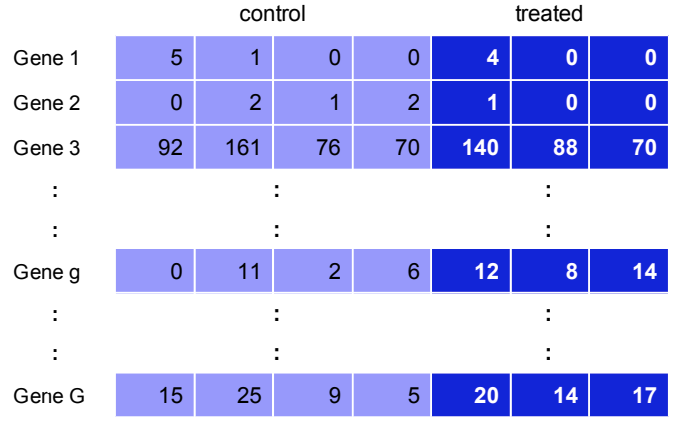
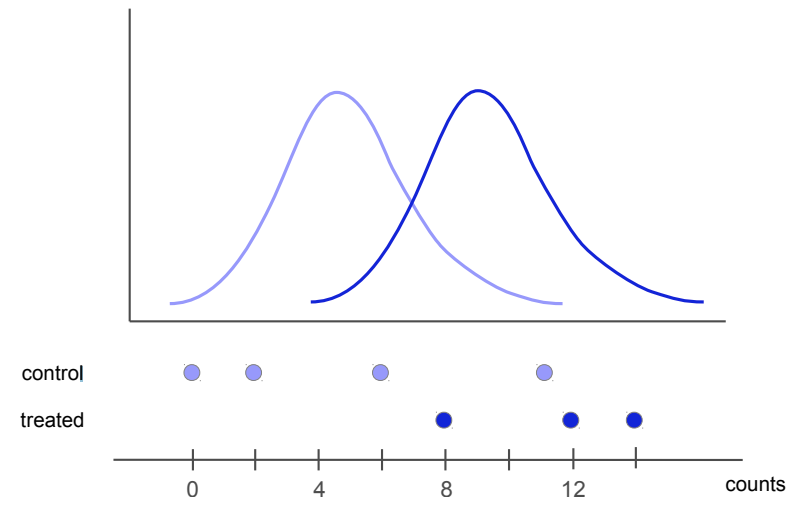

### Overview

* Overview Statistical inference 
* Creating a design matrix
* Estimation of dispersion parameters
* Model fitting and hypothesis testing
* Useful graphics


## Statistical Inference
The goal of differential gene expression analysis is to determine if the change in expression --- for each gene independently, in different conditions --- is statistically significant. To achieve this, we will fit a statistical model to expression data of each gene and perform hypothesis tests. Our goal is to determine if a gene is differentially expressed upon salt treatment, *__while adjusting for any changes that might arise due to the effect of location (inland and beach).__ *  

The idea of hypothesis testing is that:

1. __We formalize a hypothesis --- $H_A$, the alternative hypothesis --- into a statement__, such as: gene _g_ is differentially expressed between the conditions


2. __Collect appropriate data__

{width=60%}

3. __Fit the model for each gene__

{width=50%}

A typical analysis involves fitting regression models. These can take the form of:

$$
Y = \beta_0 + \beta_1 X_1+ \epsilon
$$

where 

* $Y$ denotes normalized expression values for a gene in all conditions
* $\beta_0$ coefficient is the intercept, and typically represents the average expression of the baseline (control) group 
* $\beta_1$ is the treatment effect, _i.e_ the coefficient (slope term) representing the linear relationship
* $X_1$ is the treatment factor
* $\epsilon$ is a mean-zero random error term

We will fit a multiple linear regression model, specifically an additive model, that includes an extra term of location, $X_2$, since we are interested in changes of expression after adjusting for any changes due to location.

The additive model will take the form of:
$$
Y = \beta_0 + \beta_1 X_1 + \beta_2 X_2 + \epsilon
$$

Note that in this workshop we fit a negative binomial (NB) model to  read counts, hence the need for a __Generalized linear model (GLM)__. GLMs are an extension of classical linear models to non-normally distributed response data.

Why do we use the NB distribution for analysis of RNA-Seq data?
* Reads are count based, they can't be normally distributed
* Two distributions for count based data are:
  + poisson (which presumes the variance and mean [of expression] are equal; or 
  + Negaetibe binomial (presumes variance and mean are not equal). The low number of bilogical replocates in most RNA-Seq studies results in variance not being equal to mean, hence the need for NB distribution. A good estimate of variance for each gene is essential to determine whether the changes are due to chance.  

4. __Use statistics to quantify the difference__

{width=50%}

  + Hypothesis testing with likelihood ratio tests (LRTs): Test of the goodness-of-fit between two models
  + Correction for multiple hypothesis testing


## Design matrix

Let us first load required packages.
```{r, purl=FALSE, warning=FALSE}
library(edgeR) #Main package for DE analysis
library(tidyverse) #Data wrangling package, includes ggplot2, dplyr, tidy, readr
library(RColorBrewer) #Colour scheme for plotting
library(Glimma) #Interactive MD plots
library(gplots)
```

We first create a design matrix for the linear models. A design matrix represents the independent variables/factors that have
an influence in the response variable (gene expression), and also the way we have coded the information and the design of the experiment. There are many ways of creating the design matrix, but the most important thing to remember is that the biological question determines how the matrix is created, and subsequently how we frame hypothesis tests. In this analysis we wish to test whether --- for each gene --- the expression differs significantly between plants treated with salt and water control, after adjusting for differences between land and beach. In statistical terms, this is an additive linear model, and will be reflected in the design matrix. This type of additive model corrects/adjusts for baseline differences between locations. 


We load the original copy of the `DGEList` object from the previous analysis to the current R environment.
```{r, purl=FALSE}
dge<-readRDS("dge_orig.rds")
lcpm <- cpm(dge, log=TRUE)
dge
```

If you do not have the "dge_orig.rds" in your local directory from previous analysis, download the object from a public repository as shown below (remember to remove the comments #):
```{r, purl=FALSE}
#download.file(url="https://ndownloader.figshare.com/files/24103316", destfile = "dge_orig.rds")
#dge<-readRDS("dge_orig.rds")
```


Next, we filter out lowly expressed genes, and normalize with the TMM method: 

```{r, purl=FALSE}
keep.exprs <- filterByExpr(dge)
dge <- dge[keep.exprs,, keep.lib.sizes=FALSE]
dge <- calcNormFactors(dge, method = "TMM")
lcpm <- cpm(dge)
```

Note that for a multivariate model, all combinations of treatments/group should be replicated in the second variable/factor. That is, we should have Control (C) and Treatment (T) samples in __both__ inland and beach. 

We create a design matrix using the `model.matrix` function. 
```{r, purl=FALSE}
group<-as.factor(rep(c("C","T","C","T"), c(3,3,3,3)))

location<-as.factor(rep(c("inland","beach"),c(6,6)))

#We make "inland" the reference level
location<-relevel(location,"inland")

#Create the design matrix, with intercept
#The order matters: our factor of interest LAST
mod <- model.matrix(~ location + group)

#Without intercept:
#mod <- model.matrix(0 + location + group)

#Rename rows of the model to correspond to sample names
rownames(mod) <- colnames(dge)
```

Let us take a look at the  model:
```{r, purl=FALSE}
mod
```

We see three coefficients, sometimes called "dummy variables or indicator functions".  The last coefficient (coefficient 3, groupT) representing the effect of treatment on gene expression, after adjusting for differences due to location. This is our coefficient of interest. This coefficient of the indicator variable 'groupT' is the difference between the mean gene expression value of the indicated category (groupT = 1, *i.e* treatment level)  and the mean gene expression values for the other category (groupT = 0, *i.e* control level), at **fixed values** of the other explanatory variable, *i.e* location. 

Notice how indicator variables take on values of either 0 or 1. For instance, 'groupT' takes on a value of 1 if the sample is treated, otherwise 0. 

The 'Intercept' coefficient represents the (average) baseline expression at inland location.  


## Estimate dispersion 
The number/count of reads $K_g$ for a gene $g$ are commonly modeled with the Poisson distribution
$$
K_g ∼ Pois(λ_g)
$$

whose mean and variance are both equal to $λ_g$. Due to heterogeneity (difference between replicates), the variance is often much larger than the mean, making the Poisson assumption not realistic. A negative binomial distribution --- an approximation of the Poisson distribution where the variance is allowed to exceed the mean --- is preferred, hence the need to estimate an overdispersion parameter $φ_g$ that arises. The variance of read counts for a gene then becomes 

$$
Var(K_g) = λ_g + φ_gλ^2_g
$$

We estimate the overdispersion parameter using the `estimateDisp` function. 

```{r, purl=FALSE}
dge2 <- estimateDisp(dge, design = mod)
```

We then plot the biological coefficient of variation (BCV). BCV is the coefficient of variation (CV) with which the (unknown) true abundance of the gene varies between replicate RNA samples. It represents the CV that would remain between biological replicates if sequencing depth could be increased indefinitely. The BCV is the square root of the negative binomial dispersion.

```{r, purl=FALSE}
plotBCV(dge2)
```


## Model fitting & Hypothesis testing

We fit a negative binomial GLM to the read counts for each gene, using the edgeR `glmFit` function.

```{r, purl=FALSE}
fit <- glmFit(dge2, mod)
```

We determine differential expression by performing a likelihood ratio test (LRT) using edgeR's `glmLRT` function. LRTs are used to compare a null model $m_O$ to an alternative model $m_A$, such that $m_O$ is nested in $m_A$. 

In a univariate simple linear regression example:
$$
Y = \beta_0 + \beta_1X
$$

The null model $m_O$ becomes:

$$
H_O: Y = \beta_0
$$
The alternative model $m_A$ becomes: 
$$
H_A: Y = \beta_0 + \beta_1X
$$
A LRT determines whether $\beta_0$ alone can explain the change in $Y$ without the need for $\beta_1$, hence the null hypothesis that the smaller model is the "best" model. 

Mathematically, the LRT statistic is defined by:
$$
LRT=-2ln\left(\displaystyle \frac{\hat\theta_O|X}{\hat\theta_A|X}\right)
$$
where:
$$
\hat\theta_O
$$
and 
$$
\hat\theta_A
$$
are the maximum likelihood estimators (MLEs) for the parameters of the respective models: 

$$
\hat\beta_0
$$ 
and 
$$
\hat\beta_1
$$
Maximum likelihood is a method of estimating parameters.  

The LRT statistic is then compared to a $\chi^2$ distribution with degrees of freedom equal the difference in the number of parameters for the two models.


Before identifying DEGs in salt treatment (using LRT), we first check whether there was a genuine need to adjust for location. We do this by testing differential expression between the two locations. The intercept coefficient term specifies the average baseline expression for inland, while coefficient 2 (locationbeach) corresponds to "offset" relative to inland, _i.e_ the effect of beach. The goodness-of-fit LRT compares the reduced model (intercept only, null hypothesis) with larger model having two coefficients (Intercept and locationbeach).

```{r, purl=FALSE}
#LRT: inland Vs beach
glf_B_vs_I <-glmLRT(fit, coef = 2)

#extract most DEGs
topTags(glf_B_vs_I)
```

Get the top most DEGs as a table: 
```{r, }
topTags(glf_B_vs_I)[[1]][,7:11]
```

The result of the columns is a follows:

* logFC: the logarithm (to base 2) of the fold change
* logCPM: the average log2 counts-per-million (CPM) for each gene
* LR: the LRT statistic
* PValue: p-value for the statistical significance of this change
* FDR: p-value adjusted for multiple testing with the Benjamini-Hochberg procedure 

We observe a number of DEGs between beach and inland, hence need to adjust for that effect since we are interested in the treatment effect. 

Next, we perform LRT to obtain DEGs for the treatment effect, adjusting for location differences.
```{r, purl=FALSE}
#LRT
glf_T_vs_C <-glmLRT(fit, coef = 3)
```

## Correcting for multiple hypothesis testing

Since we	are	fitting one	model	for	each	gene of interest,	and	therefore performing	thousands	of	tests, we run into an issue where the Type	I	error	is	not	equal	to	the	significance level	of	each	test. We try	to	fix	this by performing multiple test correction, also known as adjusting P values. See [Jafari & Ansari-Pour., 2018](https://www.ncbi.nlm.nih.gov/pmc/articles/PMC6099145/) for a review of different methods of adjusting P values. 

Some of the methods for adjusting p values include:

* Benjamini-Hochberg
* Bonferroni
* BY: Benjamini, Hochberg, and Yekutieli 

Let us first interrogate the top DEGs:
```{r, purl=FALSE}
topTags(glf_T_vs_C)
```

We then obtain all the DEGs with adjusted P value cutoff of 0.1
```{r, purl=FALSE}
pvals_T_vs_C<-topTags(glf_T_vs_C, n = "Inf", adjust.method = "BH", sort.by = "PValue", p.value = 0.1 )

#subset to get the dataframe from the edgeR object
pvals_T_vs_C<-pvals_T_vs_C[[1]] 
```

Next, count genes with adjusted P value of less than or equal to 0.1 (i.e FDR <= 0.1). We will use the data wrangling package `dplyr`, which is included in `tidyverse` package. 

We first obtain the top 10 genes, with FDR cutoff of 0.1

```{r, purl=FALSE}
pvals_T_vs_C %>%
  dplyr::filter(FDR <= 0.1) %>%
  head(10)
```

We can also interrogate bottom DEGs. Note that the FDR cutoff of 0.1 falls within the raw P value of 0.05, corresponding to the an adjusted Type I error. 
```{r, purl=FALSE}
pvals_T_vs_C %>%
  dplyr::filter(FDR <= 0.1) %>%
  tail()
```

We now obtain the total number of DEGs with FDR cutoff of 0.1
```{r, purl=FALSE}
pvals_T_vs_C %>%
  filter(FDR <= 0.1) %>%
  count() 
```

> **Learning Check!**
>
> * How many genes are DE with FDR <=0.1 using Bonferroni method? Which of the two methods (BH Vs Bonferroni) seem to be more stringent?

## Useful graphical representations of differential expression results
Get number of up and down regulated genes:
```{r, purl=FALSE}
dt<-decideTests(glf_T_vs_C, adjust.method = "BH", p.value = 0.1)
summary(dt)
```


We then make a scatter-plot showing the DEGs
```{r, purl=FALSE}
#create a dataframe with 'sign' column showing Up, Down, or Non.sig
sign.dat<-glf_T_vs_C$table %>%
  dplyr::mutate(sign=case_when(logFC>0 & PValue < 0.05 ~ "Up",
                               logFC<0 & PValue < 0.05 ~ "Down",
                               PValue > 0.05 ~ "Non.sigf")
                )

head(sign.dat)
```

```{r, purl=FALSE}
ggplot(sign.dat, aes(x = logCPM, y=logFC,col=sign)) +
#  geom_point(alpha=0.4) + 
  geom_point() + 
  scale_colour_manual(values=c("blue","black","red")) + 
  labs(x = "Average log CPM", y = "log-fold-change") +
  theme(legend.position = c(0.9, 0.9), legend.title = element_blank()) +
  theme(
    axis.title.x = element_text(size=14),
    axis.title.y = element_text(size=14), 
    axis.text.x = element_text(size = 14), 
    axis.text.y = element_text(size = 14)
  )
```


We can create an interactive MD plot using the `glmMDplot` function from `Glimma` package:
```{r, purl=FALSE}

glMDPlot(glf_T_vs_C  , coef=3, status=dt, #main=colnames(glf_Inland_T_vs_Inland_C)[1],
         side.main="Geneid", counts=lcpm, groups=group, launch=TRUE)
```


Heatmap of the top 100 DE genes
```{r, purl=FALSE, warning=FALSE}
tr.vs.utr.topgenes <- pvals_T_vs_C$Geneid[1:100] #get IDS of top DEGs
i <- which(dge$genes$Geneid %in% tr.vs.utr.topgenes) #Get their index in the expression table
mycol <- colorpanel(1000,"blue","white","red")
heatmap.2(lcpm[i,], scale="row",
          labRow=dge$genes$Geneid[i], labCol=rownames(dge$samples),
          col=mycol, trace="none", density.info="none", dendrogram="column")

```

As expected, we observe two main clusters, wherein samples are group based on on treatment and control. Additionally, all biological replicates are clustered together.

## Conclusion

* Think about the study design and the data analysis approach before executing the experiment
* Remember to account for other potential effects---for instance sequencing lane effect, or batch effect---in your statistical model
* RNA-Seq data analysis is an iterative process. Compare results from different statistical models, or packages. 


