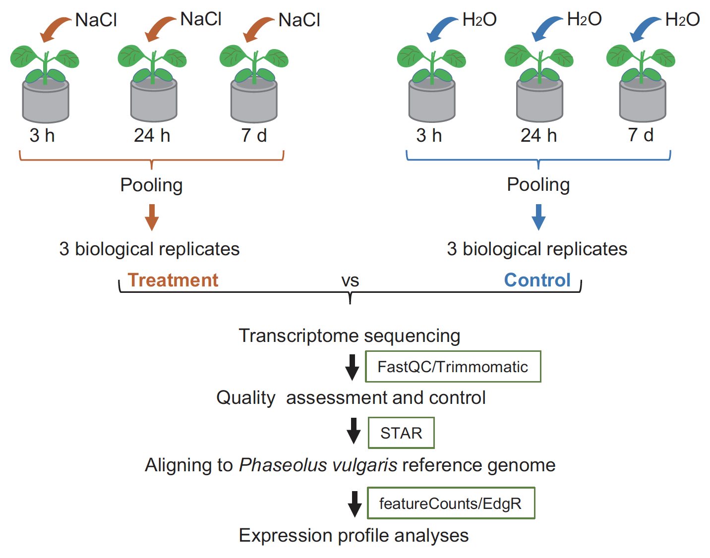

## Overview
* Review the study design, and perform a 2 X 2 factorial design analysis 
* Test for interaction between explanatory variables


## Review of the study design
A closer review of the original study by [Zhang et al., 2018](https://www.nature.com/articles/sdata2018290) reveals that plants were not planted at the beach or inland location, rather there are two plant genotypes (strains) --- one that's adapted to saline environment (beach genotype) and another one that's not (inland genotpe, or wild type). Experimental intervention involving treatment with salt was performed on both genotypes, resulting in a 2 X 2 factorial study design with factors being genotype (formerly location) and treatment.

{width=80%}

Let us first load required packages.
```{r, purl=FALSE, warning=FALSE}
library(edgeR) #Main package for DE analysis
library(tidyverse) #Data wrangling package, includes ggplot2, dplyr, tidy, readr
library(RColorBrewer) #Colour scheme for plotting
library(Glimma) #Interactive MD plots
library(gplots)
library(kableExtra)
#library(magick)
```

Then load the original copy of the `DGEList` object from the previous analysis to the current R environment.
```{r, purl=FALSE}
dge<-readRDS("dge_orig.rds")
keep.exprs <- filterByExpr(dge)
dge <- dge[keep.exprs,, keep.lib.sizes=FALSE]
dge <- calcNormFactors(dge, method = "TMM")
lcpm <- cpm(dge, log=TRUE)
```

If you do not have the "dge_orig.rds" in your local directory from previous analysis, download the object from a public repository as shown below (remember to remove the comments #):
```{r, purl=FALSE}
#download.file(url="https://ndownloader.figshare.com/files/24103316", destfile = "dge_orig.rds")
#dge<-readRDS("dge_orig.rds")
#keep.exprs <- filterByExpr(dge)
#dge <- dge[keep.exprs,, keep.lib.sizes=FALSE]
#dge <- calcNormFactors(dge, method = "TMM")
#lcpm <- cpm(dge, log=TRUE)
```

### Research Questions

Note that for a multivariate model, all combinations of treatments/group should be replicated in the second variable/factor.

On Day 2, we tested whether --- for each gene --- the expression differs significantly between plants treated with salt and water control, after adjusting for differences between land and beach. In statistical terms, this is an additive linear model, and will be reflected in the design matrix. This type of additive model corrects/adjusts for baseline differences between locations.

However, we are not going to treat location factor as a variable to hold constant, rather we test the following:

1. Which genes respond to salt treatment in inland genotype (wild-type) plants
2. Which genes respond to salt treatment in beach genotype (mutant) plants, and,
3. Which genes respond **_differently_**  --- upon salt treatment --- in mutant compared to wild-type plants. This is the interaction term, _i.e_ the environment---genotype interaction.   

## Design matrix
There are several ways to setup a design matrix. Unlike Day 2 analysis that included an intercept (coefficient for baseline expression for wild-type), we will create a design matrix without the intercept. Additionally, we will take a simple, multi-purpose approach for the multi-factor analysis by combining all the experimental factors into one combined factor: **_Group_** factor. 

```{r, purl=FALSE}
group<-as.factor(rep(c("C","T","C","T"), c(3,3,3,3)))

genotype<-as.factor(rep(c("inland","beach"),c(6,6)))

#We make "inland" genotype the reference level
genotype<-relevel(genotype,"inland")

#Create a new Group factor: 
Group <- factor(paste(group,genotype,sep="."))

#Create the design matrix, WITHOUT intercept
mod <- model.matrix(~0 + Group)

#Rename rows of the model to correspond to sample names
rownames(mod) <- colnames(dge)
```

Let us take a look at the  model:
```{r, purl=FALSE}
mod
```

We use this simple group-mean parametrization instead of a classic factorial model because it allows contrasts between the groups to be extracted in a simple and transparent way. For example, obtaining DE genes upon salt treatment in the WT genotype involves simply comparing coefficients 2 and 4. However, we first estimate dispersion parameters and fit a NB GLM before performing these comparisons.


## Estimate dispersion 
We estimate the overdispersion parameter using the `estimateDisp` function. 

```{r, purl=FALSE}
dge2 <- estimateDisp(dge, design = mod)
```

We then plot the biological coefficient of variation (BCV). BCV is the coefficient of variation (CV) with which the (unknown) true abundance of the gene varies between replicate RNA samples. It represents the CV that would remain between biological replicates if sequencing depth could be increased indefinitely. The BCV is the square root of the negative binomial dispersion.

```{r, purl=FALSE}
#plotBCV(dge2)
```

## Model fitting & Hypothesis testing

We fit a negative binomial GLM --- using gene-specific dispersions estimated above --- to the read counts for each gene.

```{r, purl=FALSE}
  fit <- glmFit(dge2, mod)
```

Likelihood ratio statistics are computed for the comparison of interest. We will use contrasts to specify coefficients of interest.

### DE expression in WT plants
1. Which genes respond to salt treatment in inland (wild-type) plants: the _contrast_ argument below specifies that the second and the fourth groups, _i.e  Coefficient 2 and 4_, are to be compared.   
```{r, purl=FALSE}
#LRT
glf_T_vs_C_inland <-glmLRT(fit, contrast = c(0,-1,0,1))
# Collate results for the most significant genes:
topTags(glf_T_vs_C_inland)
```
Next, we correct for multiple hypothesis testing, using Benjamini-Hochberg correction, and obtain DE genes with  an adjusted P value cut-off or 0.1
```{r, purl=FALSE}
pvals_T_vs_C_inland<-topTags(glf_T_vs_C_inland, n = "Inf", adjust.method = "BH", sort.by = "PValue", p.value = 0.1 )

#subset to get the dataframe from the edgeR object
pvals_T_vs_C_inland<-pvals_T_vs_C_inland[[1]]
```

We now obtain the total number of DEGs with FDR cutoff of 0.1
```{r, purl=FALSE}
pvals_T_vs_C_inland %>%
  filter(FDR <= 0.1) %>%
  count() 
```

> **Learning Check!**
>
> * How many genes are DE with FWER <= 0.1 (using Bonferroni method) in the beach mutant strain? Which strain has the largest number of DE genes? 

### DE in mutant plants
2. Which genes respond to salt treatment in beach (mutant) genotype plants: _Coefficient 1 Vs 3_ 
```{r, purl=FALSE}
#LRT
glf_T_vs_C_beach <-glmLRT(fit, contrast = c(-1,0,1,0))

# Collate results for the most significant genes:
pvals_T_vs_C_beach<-topTags(glf_T_vs_C_beach, n = "Inf", adjust.method = "BH", sort.by = "PValue", p.value = 0.1 )
pvals_T_vs_C_beach<-pvals_T_vs_C_beach[[1]]
pvals_T_vs_C_beach %>%
  filter(FDR <= 0.1) %>%
  count() 
```

We can identify number of genes that are DE in both genotypes, i.e the intersection of the two genotypes:
```{r, }
pvals_T_vs_C_beach_0.1 <- pvals_T_vs_C_beach %>%
  filter(FDR <= 0.1)
pvals_T_vs_C_inland_0.1 <- pvals_T_vs_C_inland %>%
  filter(FDR <= 0.1)
inner_join(pvals_T_vs_C_beach_0.1, pvals_T_vs_C_inland_0.1, by = "Geneid") %>%
  count()
```

### Interaction Term
3. Which genes respond *__differently__* in mutant compared to wild-type plants. These are genes for whom treatment does not present the same effect in the two genotypes. 

We test this by including an interaction term, _i.e_ the environment---genotype interaction, in the regression model. 

Traditionally, an interaction model will take the form of:

$$
Y = \beta_0 + \beta_1 X_1 + \beta_2 X_2 + \beta_3 X_1*X_2 + \epsilon
$$
Unlike an additive model without interaction term, the effect of treatment $X_1$ on expression $Y$ is no longer constant since changing genotype $X_2$ will change the impact of treatment $X_1$ on $Y$, hence the treatment--genotpye interaction.  

We create a factorial model (with an intercept) as shown below:
```{r, purl=FALSE}
mod<-model.matrix(~ genotype + group + genotype:group)
rownames(mod) <- colnames(dge)
mod
```

Interaction terms are not routinely included in regression models. Inclusion is indicated in three situations: 

1. when a question of interest pertains to interaction
2. when good reason exist to suspect interaction 
3. when interactions are proposed as a more general model for the purpose of examining the goodness of fit of a model without interaction. 

Note that our factorial formula with an interaction term is primarily useful as a way to conduct an overall test for interaction, since in most cases the generated coefficients are not of scientific interest.

Coefficients in the factorial model above are
```{r, purl=FALSE}
colnames(mod)
```

Next, we need to perform a (gene-wise) LRT to determine whether the coefficient for the interaction term is statistically significant. 

> **Learning Check!**
>
> * While performing LRT to test for the interaction term, what varibles or coefficients will be included in the full model?
> * What variables or coefficients are included in the reduced model? 

Estimate dispersion:
```{r, purl=FALSE}
dge2 <- estimateDisp(dge, design = mod)
```

We fit a negative binomial GLM --- using gene-specific dispersion estimated above --- to the read counts for each gene.

```{r, purl=FALSE}
fit <- glmFit(dge2, mod)
```


Next, we perform LRT. Note that we specify coefficient number 4 below.
```{r, purl=FALSE}
#LRT
glf_int <-glmLRT(fit, coef = 4)

# Collate results for the most significant genes:
pvals_int<-topTags(glf_int, n = "Inf", adjust.method = "BH", sort.by = "PValue", p.value = 0.1 )
pvals_int<-pvals_int[[1]]
pvals_int %>%
  filter(FDR <= 0.1) %>%
  count() 
```

Interactive plot to interrogate changes in gene expression: 

```{r, purl=FALSE}
dt<-decideTests(glf_int, adjust.method = "BH", p.value = 0.1)
glMDPlot(glf_int  , coef=4, status=dt, #main=colnames(glf_Inland_T_vs_Inland_C)[1],
         side.main="Geneid", counts=lcpm, groups=group, launch=TRUE)
```

Interrogating DE genes, we observe a separate lines model that is associated with an interaction term!
If there was no interaction, then the 'spread' of expression values in the _C_ group would be similar to the spread in the _T_ group, *i.e* we would observe two parallel lines for the parallel lines model!

## Review of linear regression models
To illustrate different regression models for separate lines (interaction), parallel lines (additive model), and equal lines (simple linear regression) model, we will use data from a study that set out to determine the effect of _light intensity_ and _timing_ of light on the number of flowers a meadowfoam plant produces. The small plant is used to create seed oil. Data from this study is found in the `R` package **Sleuth3** (https://rdrr.io/cran/Sleuth3/). 

```{r, purl=FALSE, warning=FALSE}
library(Sleuth3)
case0901 = transform(case0901, Time = factor(ifelse(case0901$Time > 1, "Early", "Late")))
head(case0901)
```

### An equal lines model
```{r, purl=FALSE}
#create the model
lm = lm(Flowers ~ Intensity, data=case0901)
summary(lm)

ggplot(case0901, aes(x = Intensity, y=Flowers)) +
    #  geom_point(alpha=0.4) + 
    geom_point() + geom_smooth(method = "lm", se = FALSE, mapping=aes(y=predict(lm,case0901))) + 
    scale_colour_manual(values=c("blue","red")) + 
    labs(x = "Light intensity", y = "Average # of flowers") +
    ggtitle("Flowers ~ Intensity") + 
    theme(legend.position = c(0.9, 0.9), legend.title = element_blank()) +
    theme(
        axis.title.x = element_text(size=14),
        axis.title.y = element_text(size=14), 
        axis.text.x = element_text(size = 14), 
        axis.text.y = element_text(size = 14)
    )
```

### A parallel lines model
```{r, purl=FALSE}
#create a multiple regression model, without interaction term
lm = lm(Flowers ~ Intensity + Time, data=case0901)
summary(lm)
ggplot(case0901, aes(x = Intensity, y=Flowers,col=Time)) +
    #  geom_point(alpha=0.4) + 
    geom_point() + geom_smooth(method = "lm", se = FALSE, mapping=aes(y=predict(lm,case0901))) + 
    #scale_colour_manual(values=c("blue","red")) + 
    labs(x = "Light intensity", y = "Average # of flowers") +
  ggtitle("Flowers ~ Intensity + Time") + 
    theme(legend.position = c(0.9, 0.9), legend.title = element_blank()) +
    theme(
        axis.title.x = element_text(size=14),
        axis.title.y = element_text(size=14), 
        axis.text.x = element_text(size = 14), 
        axis.text.y = element_text(size = 14)
    )
```

Note that both light intensity and time have a significant effect on the number of flowers. 
Additionally, it's important to note that the two lines in the figure above **do not** represent regression model. A regression model for two variables would be a plane (a 2-d model). 

### A separate lines model
```{r, purl=FALSE}
#create a multiple regression model, without interaction term
lm = lm(Flowers ~ Intensity + Time + Intensity*Time, data=case0901)
summary(lm)
ggplot(case0901, aes(x = Intensity, y=Flowers,col=Time)) +
    #  geom_point(alpha=0.4) + 
    geom_point() + geom_smooth(method = "lm", se = FALSE, mapping=aes(y=predict(lm,case0901))) + 
    #scale_colour_manual(values=c("blue","red")) + 
    labs(x = "Light intensity", y = "Average # of flowers") +
  ggtitle("Flowers ~ Intensity + Time + Intensity * Time") + 
    theme(legend.position = c(0.9, 0.9), legend.title = element_blank()) +
    theme(
        axis.title.x = element_text(size=14),
        axis.title.y = element_text(size=14), 
        axis.text.x = element_text(size = 14), 
        axis.text.y = element_text(size = 14)
    )
``` 

The coefficient for interaction term is almost Zero! Probably no need to include interaction term in the model. 

We can also test signifance of interaction term using using extra sum of squares F-test (analogous to LRT), but for coefficients estimated by the ordinary least squares method! 
We test the adequacy of the reduced model (without interaction) compared to full model
```{r, }
lm_reduced <-lm(Flowers ~ Intensity + Time,  data=case0901)
anova(lm_reduced,lm)
```
 


Let us consider a data set that has a significant interaction term: a data set called, Melanoma, which is found in the package, MASS. This is a data set of 205 patients in Denmark with malignant melanoma.
```{r, purl=FALSE, warning=FALSE}
# Load package MASS
library(MASS)
?Melanoma
Melanoma$sex[Melanoma$sex == "1"] <- "male"
Melanoma$sex[Melanoma$sex == "0"] <- "female"
head(Melanoma)
```

We will focus on two explanatory variables: Age and Sex, and their effect on survival (time).
Research question: does age affect Melanoma survival time differently for men than women? 
A separate lines models would look like: 
```{r, purl=FALSE}
#fit a multiple regression model, with interaction term
lm = lm(time ~ age + sex + age*sex, data=Melanoma)
summary(lm)
ggplot(Melanoma, aes(x = age, y=time,col=sex)) +
    #  geom_point(alpha=0.4) + 
    geom_point() + geom_smooth(method = "lm", se = FALSE, mapping=aes(y=predict(lm,Melanoma))) + 
    #scale_colour_manual(values=c("blue","red")) + 
    labs(x = "Age (years)", y = "Survival Time (days)") +
  ggtitle("Time ~ Age + Sex + Age * Sex") + 
    theme(legend.position = c(0.9, 0.9), legend.title = element_blank()) +
    theme(
        axis.title.x = element_text(size=14),
        axis.title.y = element_text(size=14), 
        axis.text.x = element_text(size = 14), 
        axis.text.y = element_text(size = 14)
    )
``` 

Notice how the interaction term is marginally significant.

Going back to our RNA-Seq data set, in each of the DE genes identified in the interaction model (genes responding due to a genotype AND environment interaction), we expect to see separate lines models. Note that we are not referring to an intersection of DE genes in genotype (at constant treatment) AND treatment (constant genotype), rather genes whose treatment effect is linked to the genotype. In other words, genes for whom treatment/environment does not present the same effect in the two genotypes.  


```{r, purl=FALSE}
dt<-decideTests(glf_int, adjust.method = "BH", p.value = 0.1)
glMDPlot(glf_int  , coef=4, status=dt, #main=colnames(glf_Inland_T_vs_Inland_C)[1],
         side.main="Geneid", counts=lcpm, groups=group, launch=TRUE)
```

Let us make a plot the data for one gene (**Phvul.011G167300.v1.0**) and observe the separate lines model. We will also fit an interaction model to that data set, and determine whether the interaction term is statistically significant. 

Let us obtain the data of interest: 
```{r, purl=FALSE}
#get index of gene of interest 
index<-as.numeric(rownames(glf_int$genes[glf_int$genes=="Phvul.011G167300.v1.0", ]))
#get the gene's expression values
expression<-lcpm[rownames(lcpm) == index, ]
expression<-as.data.frame(expression)
expression$group<-group
expression$genotype<-genotype
expression
```

Fit a multiple regression model with interaction term, we make a plot to illustrate the separate lines model. 
```{r, purl=FALSE}
#Fit a multiple regression model, with interaction term
#Fun fact: RNA-Seq data analysis packages fit such (GLMs) models to each gene! 
lm = lm(expression ~ group + genotype + group*genotype, data=expression)

#Notice how the coefficient for the interaction term is statistically significant
summary(lm)

#make scatterplot
ggplot(expression, aes(x = group, y=expression,col=genotype)) +
    #  geom_point(alpha=0.4) + 
    geom_point() + geom_smooth(method = "lm", se = FALSE) + 
    #scale_colour_manual(values=c("blue","red")) + 
    labs(x = "Group", y = "Expression") +
  ggtitle("expression ~ group + genotype + group*genotype") + 
    theme(legend.position = c(0.9, 0.9), legend.title = element_blank()) +
    theme(
        axis.title.x = element_text(size=14),
        axis.title.y = element_text(size=14), 
        axis.text.x = element_text(size = 14), 
        axis.text.y = element_text(size = 14)
    )

```

> **Learning Check!**
>
> * Test the adequacy of the interaction term for the data above using the extra sum of squares F-test


## Conclussion

Interaction terms are not routinely included in regression models. Inclusion is indicated in three situations: 

1. when a question of interest pertains to interaction
2. when good reason exist to suspect interaction 
3. when interactions are proposed as a more general model for the purpose of examining the goodness of fit of a model without interaction. 
